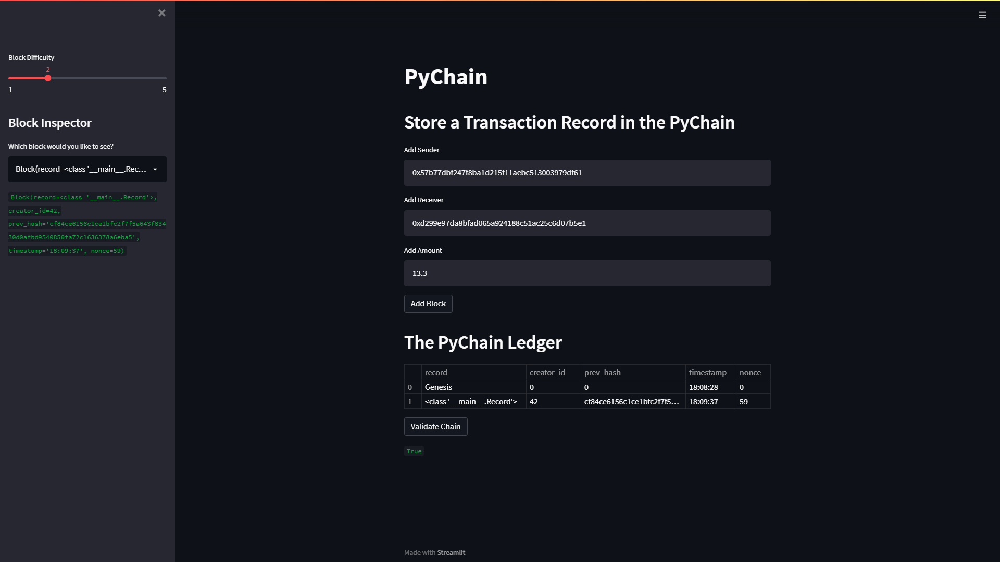
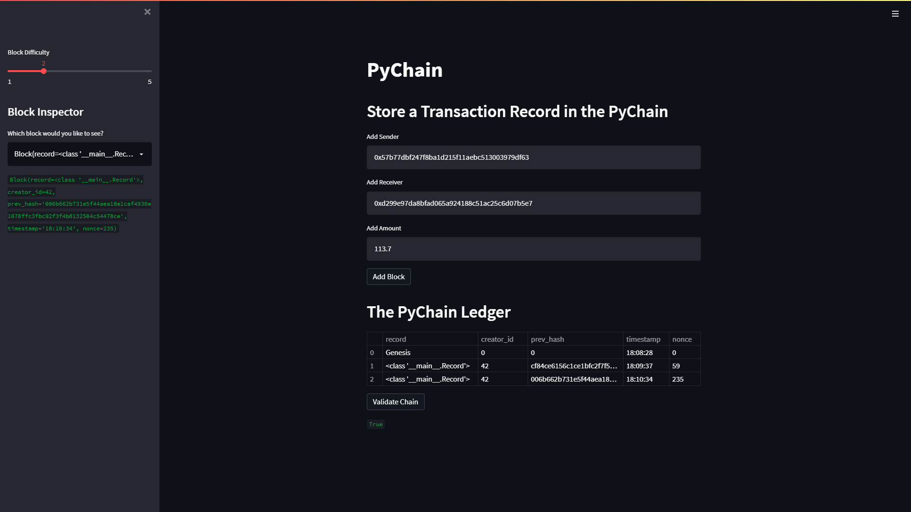
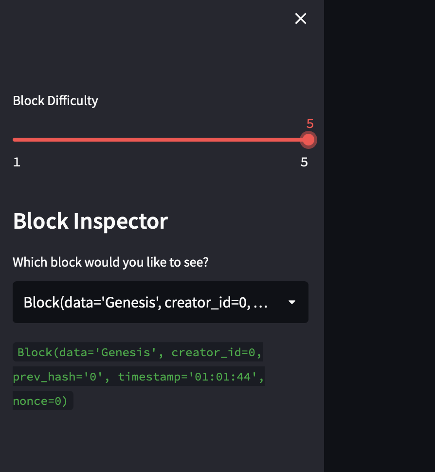

# pychain
Challenge 18

<!-- TABLE OF CONTENTS -->
<details open="open">
  <summary>Table of Contents</summary>
  <ol>
    <li>
      <a href="#about-the-project">About The Project</a>
      <ul>
        <li><a href="#built-with">Built With</a></li>
      </ul>
    </li>
    <li>
      <a href="#getting-started">Getting Started</a>
      <ul>
        <li><a href="#prerequisites">Prerequisites</a></li>
        <li><a href="#installation">Installation</a></li>
      </ul>
    </li>
    <li><a href="#usage">Usage</a></li>
  </ol>
</details>

---


<!-- ABOUT THE PROJECT -->
## About The Project

This a blockchain-based ledger system, complete with a user-friendly Streamlit web interface. This ledger allows the user to conduct financial transactions between senders and receivers, and also verify the integrity of the data in the ledger by checking the previous block's hash.

---

### Built With

<!-- This section should list any major frameworks that you built your project using. Leave any add-ons/plugins for the acknowledgements section. Here are a few examples. -->

* [Python](https://www.python.org/)
* [Python pandas](https://pandas.pydata.org/)
* [Python Streamlit](https://streamlit.io/)
* [Python conda](https://docs.conda.io/projects/conda/en/latest/user-guide/install/index.html)

---

<!-- GETTING STARTED -->
## Getting Started

<!-- This is an example of how you may give instructions on setting up your project locally. To get a local copy up and running follow these simple example steps. -->

You don't need Python directly on your system. You can install Anaconda for a virtual environment and JupyterLab normally just like any other application on your computer. Follow the instructions for Anaconda, ensure that its working, then install JupyterLab.

You will need Anaconda Navigator as the preferred tool to install the Streamlit environment.  Go to the Streamlit docs to follow the installation.

I have placed Comments throughout the code so that you can follow the Lambda code and be able to replicate the app on your own. Also, so that you're able to contribute in the future :-)

---

### Prerequisites

<!-- This is an example of how to list things you need to use the software and how to install them. -->
A text editor such as [VS Code](https://code.visualstudio.com/) or [Sublime Text](https://www.sublimetext.com/)

### Installation

1. Clone the repo
   ```sh
   git clone https://github.com/avangelinac/pychain.git
   ```

2. You don't need to install pip - Conda comes with pip and you can also use the command
    conda install 'package name'
   
3. Install Conda according to the instructions based on your operating system.
    For windows users you MUST use the Administrator PowerShell. Users with AMD Processors MUST use the Administrator PowerShell 7 (X64) version
  
    Once installed Conda has an Admin PowerShell version shortcut - look on your Start menu for it.
    This shortcut will prove very useful at times when you need to install other apps or make adjustments to your installation

    Once installed and you have finished all Conda instructions, you will see (base) on your terminal.  Make sure that you finish the Conda full installation or this will not work!!
   
4. Activate Conda Dev environment
   ```sh
   conda activate dev
   ```
    You should now see (dev) on your terminal (if not go back to step 3)

5. Install Streamlit from the Anaconda Navigator

---

<!-- USAGE EXAMPLES -->
## Usage
  
<!-- Use this space to show useful examples of how a project can be used. Additional screenshots, code examples and demos work well in this space. You may also link to more resources. -->

#### This image shows the entry of the `Sender` and `Receiver` addresses and the first entry after the Genesis block.
  - Pay close attention to the address number.
  - I'm only changing one digit at the end for the second entry but even the slightest change will cause the hash to change.
  - All validation tests passed



---

#### This image shows the entry of the `Sender` and `Receiver` addresses and the second entry after the Genesis block.
  - Did you see the changed digit at the end?
  - You are on your way to learning this blockchain stuff!
  - All validation tests passed



---

#### This image shows the entry of the `Sender` and `Receiver` addresses and the last entry after the Genesis block.
  - Did you see the changed digit at the end again?
  - This is too easy for you now!
  - All validation tests passed




## Note: Any change to the input will cause a change to the hash

---
